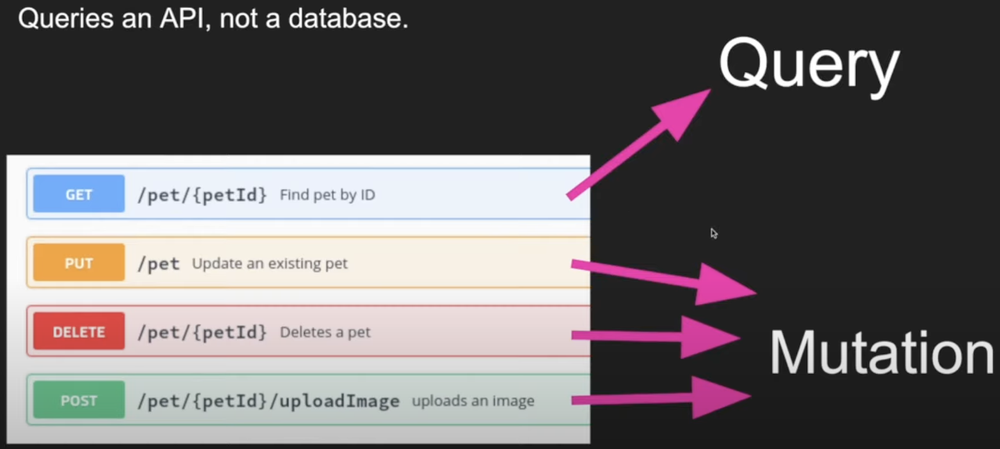

###### tags: `grapql`

Playlist: https://www.youtube.com/playlist?list=PLpPqplz6dKxXICtNgHY1tiCPau_AwWAJU

# 1. What is GraphQL

- a query language: a programming language used to get data
- not a database
- layer sits between frontend and backend
- queries and API, not a database
- 2 basic operations: `Query` vs `Mutation`
  

Differences between GgraphQL vs REST

- One endpoint
- Underfetching and overfetching

# 2. Basic Types and Queries

- Graphql playground
- has 5 scalar (basic) data types: `ID`, `String`, `Int`, `Float`, `Boolean`
- defined with keyword `type`, similar to TypeScript. e.g.:
  ```
  type User {
    id: ID!
    name: String!
    age: Int!
    height: Float!
    isMarried: Boolean
    friends: [User!] # array of Users
  }
  ```
- add `!` (exclamation mark/bang) to make a field `not null`, no bang for `nullable` (optional).
  - `[User!]`: User must be non-null, array can be empty
  - `[User!]!`: both User and array must be non-null
- countries GQL API: https://github.com/trevorblades/countries || https://countries.trevorblades.com/

## Schema

- every GQL API must have **`schemas`**: defines all the data that will exist in the API. Can see all the schemas from the Schema tab
- every schema must have a **root type**, called **`Query`**
- query must be put inside a `{...}`, then put the field we want to query. The `query` keyword is optional
- can use `input` to group input arguments

  ```
  input UserInput {
      id: ID!
      name: String!
  }

  type Query {
      users: [Users!]
      user(input: UserInput): User # get a specific user
  }
  ```

- if return value is not of scalar type (returned value is an object), must specify all the fields we want to query from this object
- an example query of "VN":
  
- run the query with shortcut: `cmd + enter` or `ctrl + enter`
- only get the fields needed => avoid overfetching or underfetching
- returned value will be a JSON, inside the `"data"` field

# 3. GraphQL API With NodeJS and Apollo Server

> NOTE: Apollo server version used in this tutorial is v3.11, current version as of this note is v4.2

### Installation:

- install packages: `graphql`, `apollo-server` (v3, deprecrated)

### Setup server:

- create a new instance of `ApolloServer` with an object with `typeDefs` and `resolvers` as param
- start Apollo server with `server.listen()`
- `index.js`:

  ```
  const { ApolloServer } = require('apollo-server');
  const { typeDefs } = require('./schema/type-defs');
  const { resolvers } = require('./schema/resolvers');

  const server = new ApolloServer({ typeDefs, resolvers });

  server.listen().then(({ url }) => {
      console.log(`APOLLO SERVER RUNNING AT ${url}`);
  });
  ```

### `typeDefs.js`:

```
const { gql } = require("apollo-server");

const typeDefs = gql`
    type Champions {
        id: ID!
        name: String!
        roles: [String!]!
        isMeta: Boolean!
    }

    type Query {
        hi: String
        champions: [Champions!]!
    }
`

module.exports = { typeDefs };
```

- put this file under `schema` folder
- holds all the type definitions for graphql
- import `gql`, put all definitions under a string template literal ``
- has a special type `Query` that includes all the queries users can make, defines the return type
- each of these queries will then be connected with an associated `resolver` function. Their names must be the same
- '#' in template is treated as comment
- in Apollo server v4, no need to import `gql` for syntax highlighting -> use comment instead:

  ```
  const typeDefs = `#graphql

  # type definitions

  `
  ```

### `resolvers.js`

```
const { favoriteChamps } = require('./favChamps');

const resolvers = {
    Query: {
        hi() {
            return "sup bitch";
        },
        champions() {
            return favoriteChamps;
        }
    }
};

module.exports = { resolvers };
```

- includes a resolvers object with key `Query`
- each field in `Query` object is a function that returns a value, matching the name in typeDefs
- functions in resolvers can be defined in 2 ways:

  ```
  #1: normal function
  champions() {
    ...
  }

  #2: arrow function (more preferred 👍)
  champion: () => {
    ...
  }
  ```

## Querying data

- open Apollo server at http://localhost:4000/
- sample run: 

# 4. GraphQL resolvers

## Enumerate types

- enum: a special kind of scalar that is restricted to a particular set of allowed values
- by convention, values are in capital (e.g. MID)
- results will be resolved to string (e.g "MID")
- define with keyword `enum`, used as a normal type
  ```
  enum Role {
      TOP
      JUNGLE
      MID
      ADC
      SUPPORT
  }
  ```

## Using type in definition

- can use the type directly inside its definition:
  ```
  type Champion {
      id: ID!
      name: String!
      roles: [Role!]!
      isMeta: Boolean!
      strongAgainst: [Champion!]
  }
  ```

## Arguments

**Query type**: define a new query in `type-defs` that takes in an argument: `champion(id: ID!): Champion`

**Resolver**:

- write a query in resolver with the name matching `type-defs`:
  ```
  champion: (_parent, args) => {
    const id = parseInt(args.id); // args always get passed in as string
    return favoriteChamps.find(champ => champ.id === id);
  }
  ```
- a resolver can optionally accept four positional arguments: `(parent, args, context, info)`.
- The **`args`** argument: an object that contains all GraphQL arguments that were provided for the field by the GraphQL operation => e.g. accessing id field with `args.id`

**Writing query in Apollo server**

- write a separate query with argument, prefix with $:
  ```
  query ChampionQuery($championId: ID!) {
    champion(id: $championId) {
      name
      roles
      strongAgainst {
        name
      }
    }
  }
  ```
- pass argument into query using the **Variables** section below:
  
- **NOTE**: args are always passed in as string, even though it looks like number -> Need to `parseInt(args.id)` first before searching so data types from args and db can match.

**Extra: Lodash basic**

- using Lodash's find() function:

  ```
  const _ = require('lodash');

  const { id } = args;
  // find in the list with the following id, make it a Number type
  return _.find(favoriteChamps, { id: Number(id) });
  ```

## Type can have its own resolvers

- each type can have its own resolvers
- that resolver is scoped to only that type, can only access that resolver from type. e.g:
  ```
  Champion: {
        game: () => {
            return "League of Legends";
        },
        abilities: () => {
            return ['Passive', 'Q', 'W', 'E', 'R'];
        },
        midChamps: () => {
            return _.filter(favoriteChamps, (champ) => {
                for (const role of champ.roles) {
                    if (roles === 'MID') {
                        return champ;
                    }
                }
            });
        }
    }
  ```

# 5. Mutations

- used to modify, or mutate data
- versus HTTP: `query` = `GET` request; `mutation` = `POST`, `PUT`, `DELETE`
- > technically, any query could be implemented to cause a data write. However, it's useful to establish a convention that any operations that cause writes should be sent explicitly via a mutation.
- mutation's fields should be verbs e.g. `createUser`
- common convention: whenever we modify a type, just return that type 
- (-> because GQL uses a lot of caching, we have to return itself to ensure it is the latest state possible)
- use `input` to group arguments
- similar to query using positional arguments, can pass data from `Variables` tab and access argument input from `args.input`
- **type-defs.js:**
  ```
  input addChampionInput {
    name: String!
    roles: [Role!] = [MID] # 
    isMeta: Boolean = false # default value
  }

  type Mutation {
      addChampion(input: addChampionInput!): Champion
  }

  ```
- **resolvers.js:**
  ```
    Mutation: {
      addChampion: (_parent, args) => {
          const newId = favoriteChamps.length + 1;
          const champ = {
              ...args.input,
              id: newId
          } 
          console.log(champ);
          favoriteChamps.push(champ);
          return champ;
      },
    }
  ```
- **Output:**

    