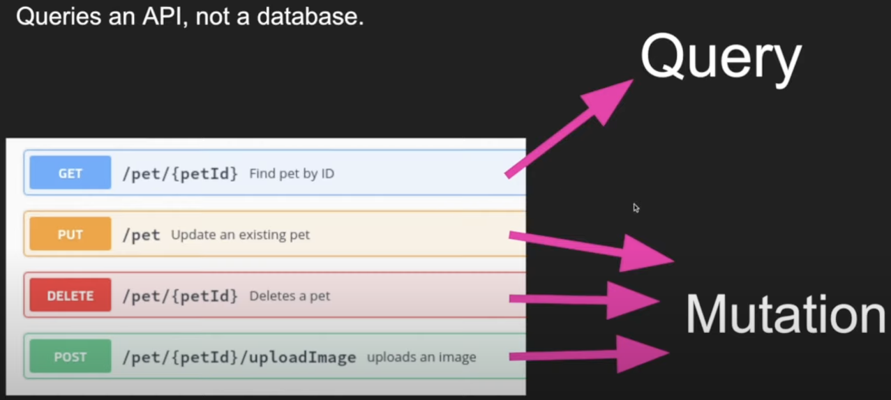
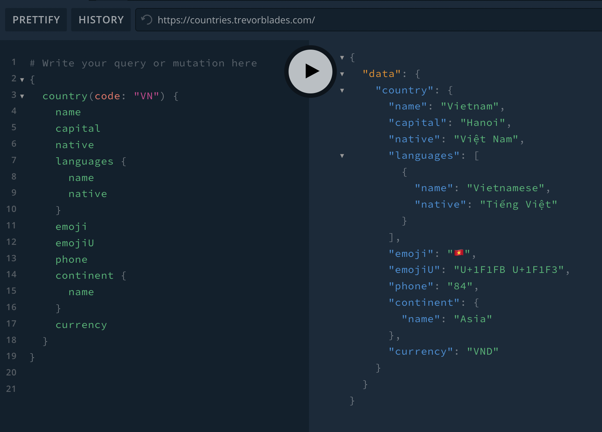
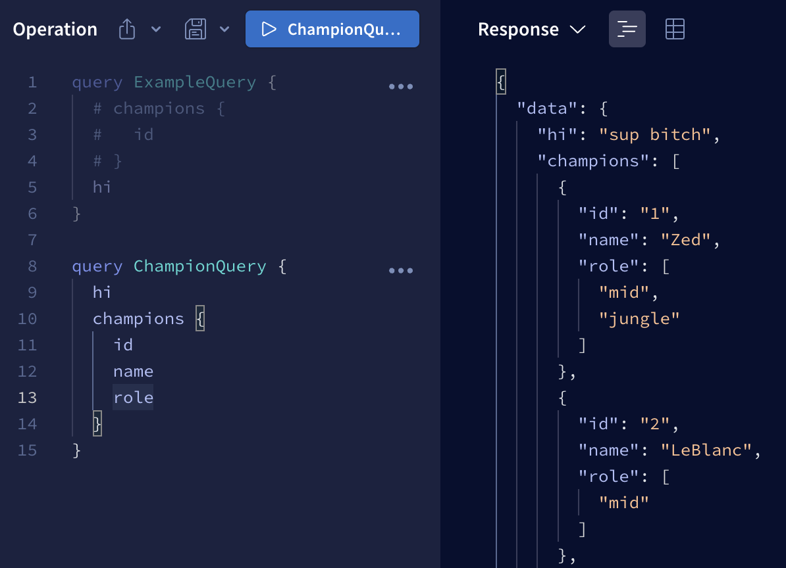
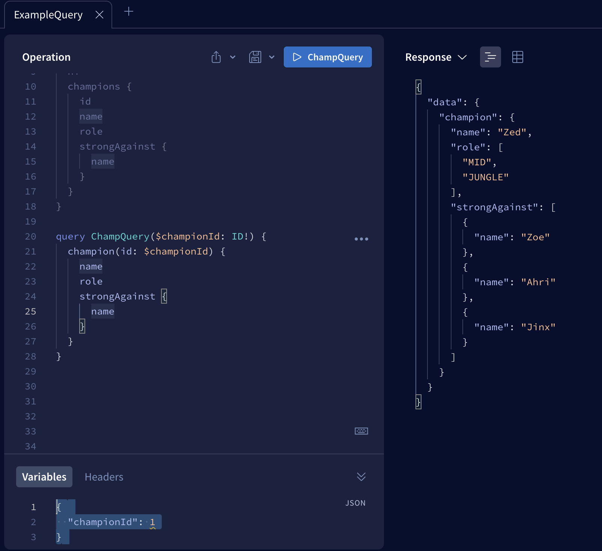
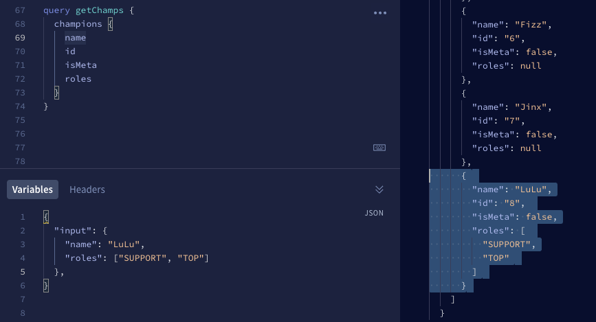
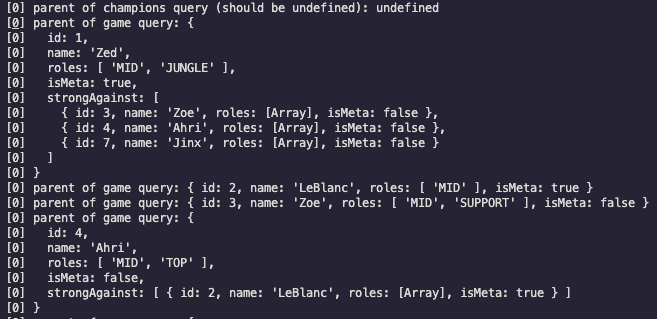
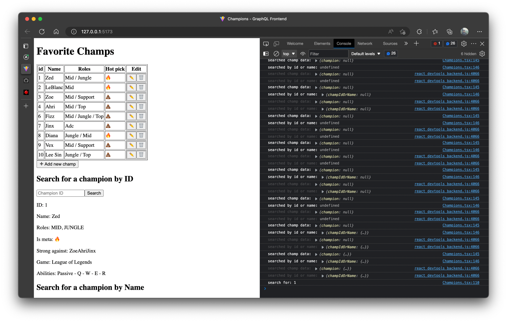
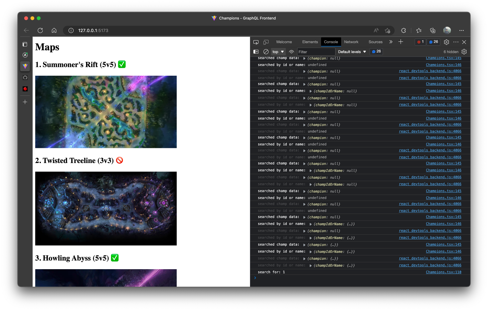

###### tags: `grapql`

## Table of Content

- [1. What is GraphQL](#1-what-is-graphql)
- [2. Basic Types and Queries](#2-basic-types-and-queries)
  - [Schema](#schema)
- [3. GraphQL API With NodeJS and Apollo Server](#3-graphql-api-with-nodejs-and-apollo-server)
    - [Installation:](#installation)
    - [Setup server:](#setup-server)
    - [`typeDefs.js`](#typedefsjs)
    - [`resolvers.js`](#resolversjs)
  - [Querying data](#querying-data)
- [4. GraphQL resolvers](#4-graphql-resolvers)
  - [Enumerate types](#enumerate-types)
  - [Using type in definition](#using-type-in-definition)
  - [Arguments](#arguments)
  - [Type can have its own resolvers](#type-can-have-its-own-resolvers)
- [5. Mutations](#5-mutations)
- [6. useQuery Hook in Apollo Client](#6-usequery-hook-in-apollo-client)
    - [Set up frontend client](#set-up-frontend-client)
    - [Using query hooks](#using-query-hooks)
      - [`useQuery` hook:](#usequery-hook)
      - [`useLazyQuery` hook:](#uselazyquery-hook)
      - [Passing query inputs `variables`:](#passing-query-inputs-variables)
      - [Using returned query data](#using-returned-query-data)
- [7. useMutation hook](#7-usemutation-hook)
    - [Usage:](#usage)
    - [Define mutation:](#define-mutation)
    - [Returned values:](#returned-values)
    - [Providing options:](#providing-options)
    - [Refetching data:](#refetching-data)
- [8. Context, Fragments, Union Result Boxes](#8-context-fragments-union-result-boxes)
  - [Resolver argument](#resolver-argument)
      - [Parent](#parent)
      - [Context](#context)
      - [Info](#info)
  - [Fragments](#fragments)
    - [Resolving a union](#resolving-a-union)
  - [Interface type](#interface-type)
- [Appendix: All Apollo Studio queries](#appendix-all-apollo-studio-queries)

---

Playlist: https://www.youtube.com/playlist?list=PLpPqplz6dKxXICtNgHY1tiCPau_AwWAJU
# 1. What is GraphQL

- a query language: a programming language used to get data
- not a database
- layer sits between frontend and backend
- queries and API, not a database
- 2 basic operations: `Query` vs `Mutation`
  

Differences between GgraphQL vs REST

- One endpoint
- Underfetching and overfetching

# 2. Basic Types and Queries

- Graphql playground
- has 5 scalar (basic) data types: `ID`, `String`, `Int`, `Float`, `Boolean`
- defined with keyword `type`, similar to TypeScript. e.g.:
  ```gql
  type User {
    id: ID!
    name: String!
    age: Int!
    height: Float!
    isMarried: Boolean
    friends: [User!] # array of Users
  }
  ```
- add `!` (exclamation mark/bang) to make a field `not null`, no bang for `nullable` (optional).
  - `[User!]`: User must be non-null, array can be empty
  - `[User!]!`: both User and array must be non-null
- countries GQL API: https://github.com/trevorblades/countries || https://countries.trevorblades.com/

## Schema

- every GQL API must have **`schemas`**: defines all the data that will exist in the API. Can see all the schemas from the Schema tab
- every schema must have a **root type**, called **`Query`**
- query must be put inside a `{...}`, then put the field we want to query. The `query` keyword is optional
- can use `input` to group input arguments

  ```gql
  input UserInput {
      id: ID!
      name: String!
  }

  type Query {
      users: [Users!]
      user(input: UserInput): User # get a specific user
  }
  ```

- if return value is not of scalar type (returned value is an object), must specify all the fields we want to query from this object
- an example query of "VN":
  
- run the query with shortcut: `cmd + enter` or `ctrl + enter`
- only get the fields needed => avoid overfetching or underfetching
- returned value will be a JSON, inside the `"data"` field

# 3. GraphQL API With NodeJS and Apollo Server

> NOTE: Apollo server version used in this tutorial is v3.11, current version as of this note is v4.2

### Installation:

- install packages: `graphql`, `apollo-server` (v3, deprecrated)

### Setup server:

- create a new instance of `ApolloServer` with an object with `typeDefs` and `resolvers` as param
- start Apollo server with `server.listen()`
- `index.js`:

  ```js
  const { ApolloServer } = require('apollo-server');
  const { typeDefs } = require('./schema/type-defs');
  const { resolvers } = require('./schema/resolvers');

  const server = new ApolloServer({ typeDefs, resolvers });

  server.listen().then(({ url }) => {
      console.log(`APOLLO SERVER RUNNING AT ${url}`);
  });
  ```

### `typeDefs.js`

```js
const { gql } = require("apollo-server");

const typeDefs = gql`
    type Champions {
        id: ID!
        name: String!
        roles: [String!]!
        isMeta: Boolean!
    }

    type Query {
        hi: String
        champions: [Champions!]!
    }
`

module.exports = { typeDefs };
```

- put this file under `schema` folder
- holds all the type definitions for graphql
- import `gql`, put all definitions under a string template literal ``
- has a special type `Query` that includes all the queries users can make, defines the return type
- each of these queries will then be connected with an associated `resolver` function. Their names must be the same
- '#' in template is treated as comment
- in Apollo server v4, no need to import `gql` for syntax highlighting -> use comment instead:

  ```js
  const typeDefs = `#graphql

  # type definitions

  `
  ```

### `resolvers.js`

```js
const { favoriteChamps } = require('./favChamps');

const resolvers = {
    Query: {
        hi() {
            return "sup bitch";
        },
        champions() {
            return favoriteChamps;
        }
    }
};

module.exports = { resolvers };
```

- includes a resolvers object with key `Query`
- each field in `Query` object is a function that returns a value, matching the name in typeDefs
- functions in resolvers can be defined in 2 ways:

  ```js
  #1: normal function
  champions() {
    ...
  }

  #2: arrow function (more preferred 👍)
  champion: () => {
    ...
  }
  ```

## Querying data

- open Apollo server at http://localhost:4000/
- sample run: 

# 4. GraphQL resolvers

## Enumerate types

- enum: a special kind of scalar that is restricted to a particular set of allowed values
- by convention, values are in capital (e.g. MID)
- results will be resolved to string (e.g "MID")
- define with keyword `enum`, used as a normal type
  ```gql
  enum Role {
      TOP
      JUNGLE
      MID
      ADC
      SUPPORT
  }
  ```

## Using type in definition

- can use the type directly inside its definition:
  ```gql
  type Champion {
      id: ID!
      name: String!
      roles: [Role!]!
      isMeta: Boolean!
      strongAgainst: [Champion!]
  }
  ```

## Arguments

**Query type**: define a new query in `type-defs` that takes in an argument: `champion(id: ID!): Champion`

**Resolver**:

- write a query in resolver with the name matching `type-defs`:
  ```js
  champion: (_parent, args) => {
    const id = parseInt(args.id); // args always get passed in as string
    return favoriteChamps.find(champ => champ.id === id);
  }
  ```
- a resolver can optionally accept four positional arguments: `(parent, args, context, info)`.
- The **`args`** argument: an object that contains all GraphQL arguments that were provided for the field by the GraphQL operation => e.g. accessing id field with `args.id`

**Writing query in Apollo server**

- write a separate query with argument, prefix with $:
  ```gql
  query ChampionQuery($championId: ID!) {
    champion(id: $championId) {
      name
      roles
      strongAgainst {
        name
      }
    }
  }
  ```
- pass argument into query using the **Variables** section below:
  
- **NOTE**: args are always passed in as string, even though it looks like number -> Need to `parseInt(args.id)` first before searching so data types from args and db can match.

**Extra: Lodash basic**

- using Lodash's find() function:

  ```js
  const _ = require('lodash');

  const { id } = args;
  // find in the list with the following id, make it a Number type
  return _.find(favoriteChamps, { id: Number(id) });
  ```

## Type can have its own resolvers

- each type can have its own resolvers
- that resolver is scoped to only that type, can only access that resolver from type. e.g:
  ```js
  Champion: {
        game: () => {
            return "League of Legends";
        },
        abilities: () => {
            return ['Passive', 'Q', 'W', 'E', 'R'];
        },
        midChamps: () => {
            return _.filter(favoriteChamps, (champ) => {
                for (const role of champ.roles) {
                    if (roles === 'MID') {
                        return champ;
                    }
                }
            });
        }
    }
  ```

# 5. Mutations

- used to modify, or mutate data
- versus HTTP: `query` = `GET` request; `mutation` = `POST`, `PUT`, `DELETE`
- > technically, any query could be implemented to cause a data write. However, it's useful to establish a convention that any operations that cause writes should be sent explicitly via a mutation.
- mutation's fields should be verbs e.g. `createUser`
- common convention: whenever we modify a type, just return that type
- (-> because GQL uses a lot of caching, we have to return itself to ensure it is the latest state possible)
- use `input` to group arguments
- similar to query using positional arguments, can pass data from `Variables` tab and access argument input from `args.input`
- **type-defs.js:**

  ```gql
  input addChampionInput {
    name: String!
    roles: [Role!] = [MID] #
    isMeta: Boolean = false # default value
  }

  type Mutation {
      addChampion(input: addChampionInput!): Champion
  }

  ```

- **resolvers.js:**
  ```js
    Mutation: {
      addChampion: (_parent, args) => {
          const lastIndex = favoriteChamps.length - 1;
          const newId = favoriteChamps[lastIndex].id + 1;
          const champ = {
              ...args.input,
              id: newId
          }
          console.log(champ);
          favoriteChamps.push(champ);
          return champ;
      },
    }
  ```
- **Output:**

  

- **Update champion resolver:**
  ```js
  updateChampion(_parent, args) {
    console.log('arg inputs:');
    console.log(args.id);
    console.log(args.name);
    console.log(args.newName);
    for (const champ of favoriteChamps) {
        if (champ.id === parseInt(args.id) && champ.name === args.name) {
            champ.name = args.newName;
            return champ;
        }
    }
    return null;
  }
  ```
- **Remove champion resolver:**
  ```js
  removeChampion: (_parent, args) => {
    for (const [i, champ] of favoriteChamps.entries()) {
        if (champ.id === parseInt(args.id)) {
            const removedChamp = favoriteChamps.splice(i, 1)[0]; // splice(start, deleteCount), returns an array, get the first element
            console.log('removed:', removedChamp);
            return removedChamp;
        }
    }
    console.log('no champ removed');
    return null;
  }
  ```

# 6. useQuery Hook in Apollo Client

### Set up frontend client

- setup with React (Vite) using Apollo Client 3
- install 2 packages: `npm install graphql @apollo/client`
- the `ApolloClient` class: create an client instance with options `uri` and `cache`. Can instantiate in either `index.js` or `App.jsx`:

  ```js
  import { ApolloClient, ApolloProvider, InMemoryCache } from '@apollo/client';

  const client = new ApolloClient({
    uri: 'http://localhost:4000', // apollo server endpoint
    cache: new InMemoryCache()
  })
  ```

- The `ApolloProvider` component: uses React's Context API to make client instance available throughout a React app. To use it, we wrap our app's top level component (e.g. `<App />`) in `ApolloProvider` component and pass `client` instance as prop:
  ```js
   <ApolloProvider client={client}>
      <div className="App">
        <Champions />
        <Maps />
      </div>
  </ApolloProvider>
  ```

### Using query hooks

- import `gql` template literal
- defining a query: query constant by convention is in all CAP; wrap query statement inside `gql`, similar to defining schema. An example query **without** param:

  ```js
  const GET_ALL_CHAMPS = gql`
      query getAllChamps {  # <- (1)
          champions {       # <- (2)
              id            # <- (3)
              name
              isMeta
              roles
          }
      }
  `;

  // NOTES
  * (1): query name (and even the query keyword) is optional and doesn't matter
  * (2): will need to access this field with exact same name in returned data (e.g. data.champions)
  * (3): specify the fields we want to get back
  ```

#### `useQuery` hook:

- returns an object; 3 most common fields that can be destructured and used: `data`, `loading` & `error`
- structure:

  ```js
  const { data, loading, error } = useQuery(QUERY_STATEMENT, options);

  // e.g.
  const { data: champData, loading: champLoading, error: champError } = useQuery(GET_ALL_CHAMPS);
  ```

- can rename fields if there're multiple queries: `{ data: champData }`
- can use states `loading` or `error` to return different views
- 2nd param in the useQuery hook is to specify options, such as passing query input with `variables`

#### `useLazyQuery` hook:

- similar to `useQuery` hook, but suitable for using when an event is triggered (e.g. button onClick); whereas `useQuery` is called whenever the function component gets executed
- returns an array: 1st item is a **callback function** to perform the query; 2nd item is an object that contains **`data`**, similar to `useQuery`:
  ```js
  const [callbackFunction, { data, loading, error }] = useLazyQuery(QUERY_STATEMENT);
  ```

#### Passing query inputs `variables`:

<ins>Query with 1 argument:</ins>

- in query definition: pass param from the query name with a dollar sign (`$`); forward it as the query's argument
- **NOTE:** ensure param data type matches the type-defs; otherwise will cause error 400!
- an example query with only 1 argument:
  ```js
  const QUERY_A_CHAMPION = gql`
    query GetChampByID($id: ID!) {
        champion(id: $id) {
            id
            name
            roles
            isMeta
            # strongAgainst # this field ALONE will cause error, cuz it needs to know the fields inside needed for query!!!
            strongAgainst {
                id
                name
                roles
                isMeta
            }
            game
            abilities
        }
    }
  `;
  ```

2 ways to use the argument in hooks:

- **Method 1 - pass into query hook**: pass into 2nd param inside hook (param) in `variables` field:
  ```js
  const [fetchChampion, { data: searchedChampData, error: searchedError }] = useLazyQuery(
      QUERY_A_CHAMPION,
      {
          variables: { id: searchedChampRef.current.value } // get from user input
      }
  );
  ```
- **Method 2 - pass into callback function**: pass an object with field `variables` as param inside callback function when call:
  ```js
  fetchChampion({
    variables: { id: searchedChampRef.current.value } // get from user input
  });
  ```
- NOTE: method 2 (in callback function) will overwrite method 1 (in query hook) if 2 `variables` objects co-exist

<ins>Query with multiple arguments:</ins>

- similar to 1 argument, but separate arguments with commas
- no `input`, so combine all arguments as a single object

  ```js
  const QUERY_CHAMP_BY_ID_NAME = gql`
    query GetChampByIdOrName($id: ID, $name: String) {
        champIdOrName(filters: { id: $id, name: $name }) {  # <- (*)
            name
            id
            roles
            isMeta
        }
    }
  `;

  (*): pay attention to the directions of the $ signs (references)
  ```

- passing argument into callback function (or similar with passing into query hook):
  ```js
  const searchByNameHandler = async () => {
    await fetchChampByIdName({
        variables: {
            name: champIdOrNameInput
            id: typeof parseInt(champIdOrNameInput) === 'number' ? champIdOrNameInput : null,
        }
    });
  };
  ```

#### Using returned query data

- returned query data will be available under field with the **same name inside query** (e.g. `champions`). Make sure to access this field first before getting the data needed
- make sure to **check for data availability** first before using; otherwise could cause error when rendering UI. Example:

  ```js
  // using optional
  <p>Name: {searchedChampData?.champion?.name}</p>

  // using && operator
  <p>Id: {champIdNameData && champIdNameData.champIdOrName?.id}</p>
  ```

Good references:

- https://www.apollographql.com/tutorials/lift-off-part1/the-usequery-hook
- https://www.apollographql.com/tutorials/lift-off-part3/the-usequery-hook---with-variables
- https://www.apollographql.com/docs/react/data/queries/
- https://stackoverflow.com/questions/65610843/react-apollo-client-query-with-input-variables

# 7. useMutation hook

### Usage:

Similar to `useQuery` hook, which is used to get the data via GET request, `useMutation` hook is used to **modify** data as PUT, POST, DELETE, PATCH requests.

- similar usage to `useQuery`:
  1. import `gql` and `useMutation` from `@apollo/client`
  2. define mutation with gql template literal
  3. call `useMutation` hook with mutation defined above

### Define mutation:
```js
const CREATE_NEW_CHAMP = gql`
    mutation CreateNewChamp($input: addChampionInput!) {
        # only need to specify the input matching the one defined in type-defs. No need to redefine
        addChampion(input: $input) {
            id
            name
            roles
        }
    }
`;
```

### Returned values:

`useMutation` returns a tuple that includes:

- A **mutate function** that you can call at any time to execute the mutation
- An **object** with fields that represent the current status of the mutation's execution (data, loading, etc.). Similar to the object returned by `useQuery` hook. See object details at: https://www.apollographql.com/docs/react/data/mutations/#result
  - ```js
    const [removeChampMutation, { data: removedChampData }] = useMutation(REMOVE_CHAMP_MUTATION);
    ```

### Providing options:

2 ways to provide options to a mutation via the `variables` option:

- from `useMutation` hook: provide options object as its second parameter
  - ```js
    const [updateChampMutation, { data: updatedChampData }] = useMutation(UPDATE_CHAMP_MUTATION, {
      variables: {
          input: {
              id: champ.id,
              name: champ.name,
              roles: champ.roles,
              isMeta: champ.isMeta
          }
      }
    });
    ```
- from mutate function: pass options as an object to where the mutate function is called
  - ```js
    removeChampMutation({
        variables: {
            id: Number(champ.id)
        }
    });
    ```

### Refetching data:

In case UI needs to be updated after executing a query, it can be done in 2 ways:

- execute the `refetch` function from `useQuery`'s returned object', bind to specific query
- include a `refetchQueries` array in the mutation options, either in the hook or in the mutate function
  - ```js
    // Refetches two queries after mutation completes
    const [addTodo, { data, loading, error }] = useMutation(ADD_TODO, {
      refetchQueries: [
        {query: GET_POST},  // can either use: DocumentNode object parsed with gql
        'GetComments'       // or use: Query name
      ],
    });
    ```

# 8. Context, Fragments, Union Result Boxes

## Resolver argument

A resolver can optionally accept 4 positional arguments in order: `(parent, args, contextValue, info)`.
- `parent`: The return value of the resolver for this field's parent (previous resolver in the resolver chain). For resolvers of top-level fields with no parent (such as fields of Query), this value is obtained from the rootValue function passed to Apollo Server's constructor.
- `args`: Most commonly used field, an object that contains all GQL args provided.
- `contextValue`: An object **shared across all resolvers** that are executing for a particular operation. Use this to share per-operation state, including authentication information, dataloader instances, and anything else to track across resolvers.
- `info`: Contains information about the operation's execution state, including the field name, the path to the field from the root, and more.

#### Parent
- levels: Query (champions) -> Champion (game)
-   
- parent of top query should be `undefined`. Parent of `game` function should be result of the previous level, which is all the fields from `champions` query

#### Context

- add context when creating a new `ApolloServer` instance as a **function** returning an object
- the context function is called once for every request => can access request's details (such as HTTP headers) through `req` object (`context.req.headers`)
- context function should be async
- ```js
  const server = new ApolloServer({
      typeDefs,
      resolvers,
      context: async ({ req, res }) => {
          return {
              player: 'Doroke',
              req
          };
      }
  });
  ```
- `player: 'Doroke'` becomes available in all resolvers throughout entire app
- ```js
  hi(parent, args, context) {
      return `sup ${context.player}`; // sup Doroke
  },
  ```

#### Info

- not many use cases :/
- can access information about the request, different from the `req` from context

## Fragments

- a piece of logic that can be shared between multiple queries and mutations
- used on client side for better code organization
- define fragment `on` a certain type, use the spread operator-like syntax (`...`) 
- ```gql
  fragment ChampNameIdFragment on Champion {
    name
    id
  }

  query FragmentQuery {
    champions {
      ...ChampNameIdFragment
    }
  }
  ```

## Union and error handling

### Union type

- an abstract GraphQL type that enable a schema field to return one of multiple object types
- all of a union's included types must be object types
- ```js
    // type-defs.js

    type ChampionsResultSuccess {
        champions: [Champion!]!
    }

    type ChampionsResultError {
        message: String!
    }

    union ChampionsResult = ChampionsResultSuccess | ChampionsResultError

    type Query {
      championsWithUnion: ChampionsResult
    }
  ```
- => in this case, `championsWithUnion` query can either return a list of champions if query successfully, or return an error message

### Resolving a union

- to fully resolve a union, Apollo Server needs to specify which of the union's types is being returned
- to achieve this, you define a `__resolveType` function for the union in your resolver map
- the function takes in 3 params: `__resolveType(obj, contextValue, info) { ... }`
- check if a field in `obj` is present, then return the name of that type as a string
- ```js
  ChampionsResult: {
    __resolveType(obj) {
        if (obj.champions) {
            return 'ChampionsResultSuccess';
        }

        if (obj.message) {
            return 'ChampionsResultError';
        }

        return null; // GraphQLError is thrown
    }
  },
  ```

### Querying a union

- client won't know what object type will be returned when using union. To account for this, a query can include the subfields of **multiple possible types**.
- ```js
  query ChampionsUnionQuery {
    championsWithUnion {
      __typename    # (optional)
      ... on ChampionsResultSuccess {
        champions {
          id
          name
        }
      }

      ... on ChampionsResultError {
        message
      }
    }
  }
  ```
- The `__typename` field: Every object type in your schema automatically has a field named. This field returns the object type's name as a String (e.g. 'ChampionsResultSuccess' or 'Maps'). This field is optional in query.
- query in React:
  ```js
  const QUERY_ALL_MAPS_WITH_UNION = gql`
    query queryAllMaps {
        maps {
            ... on MapsResultSuccess {
                maps {
                    id
                    name
                    players
                    playable
                    imageUrl
                }
            }

            ... on MapsResultError {
                message
            }
        }
    }
  `;
  ```
- accessing data in front-end:
  ```js
  const { data: mapData, loading: mapLoading, error: mapError } = useQuery(QUERY_ALL_MAPS_WITH_UNION);
  
  mapData.maps.maps // list of maps
  ```

## Interface type

- specifies a set of fields that multiple object types can include
- if an object type implements an interface, it must include all of that interface's fields
- a field can have an interface (or a list of that interface) as its return type. In this case, it can return any object type that implements that interface
- ```js
  interface Book {
  title: String!
  author: Author!
  }

  type Textbook implements Book {
    title: String! # must be present
    author: Author! # must be present
    courses: [Course!]!
  }

  type ColoringBook implements Book {
    title: String!
    author: Author!
    colors: [String!]!
  }

  type Query {
    books: [Book!]! # can include Textbook / ColoringBook objects
  }
  ```
- `Query.books` returns a list that can include both Textbooks and ColoringBooks
- clients can also query for subfields that aren't included in the interface
  ```js
  query GetBooks {
    books {
      # Querying for __typename is almost always recommended,
      # but it's even more important when querying a field that
      # might return one of multiple types.
      __typename
      title
      ... on Textbook {
        courses {
          # Only present in Textbook
          name
        }
      }
      ... on ColoringBook {
        colors # Only present in ColoringBook
      }
    }
  }
  ```
- resolving an interface is similar to a union using the `__resolveType` function:
  ```js
  const resolvers = {
    Book: {
      __resolveType(book, contextValue, info){
        // Only Textbook has a courses field
        if(book.courses){
          return 'Textbook';
        }
        // Only ColoringBook has a colors field
        if(book.colors){
          return 'ColoringBook';
        }
        return null; // GraphQLError is thrown
      },
    },
    Query: {
      books: () => { ... }
    },
  };
  ```

# Appendix: All Apollo Studio queries
Operation
```gql
query ExampleQuery {
  # champions {
  #   id
  # }
  hi
  
  champions {
    name
    id
  }
}

query ChampionsQuery {
  hi
  champions {
    id
    name
    roles
    strongAgainst {
      name
    }
  }
}

query ChampQuery($championId: ID!) {
  champion(id: $championId) {
    name
    roles
    strongAgainst {
      name
    }
    game
    abilities
    whatever
    midChamps {
      name
      roles
    }
  }
  whatever
}

query MidChampQuery($championId: ID!) {
  champion(id: $championId) {
    midChamps {
      name
      roles
    }
  }
}

# query removeChamp($removeId: ID!) {
#   removeChampion(id: $removeId) {
#     name
#     id
#   }
# }

mutation addChampion($input: addChampionInput!) {
  addChampion(input: $input) {
    id
    name
    roles
  }
}

query getChamps {
  champions {
    name
    id
    isMeta
    # roles
  }
}

mutation UpdateChampion($updateChampionInput2: updateChampionInput!) {
  updateChampion(input: $updateChampionInput2) {
    name
    id
    roles
  }
}

mutation RemoveChampion($removeChampionId: ID!) {
  removeChampion(id: $removeChampionId) {
    id
    name
  }
}

query QueryMaps {
  maps {
    id
    name
    imageUrl
  }
}

query QueryChampByIdOrName($filters: ChampionInputFilter!) {
  champIdOrName(filters: $filters) {
    id
    name
    # game
    roles
  }
}

query Hello($helloName2: String!) {
  hello(name: $helloName2)
}

query Game {
  hi
  champions {
    game
  }
}

fragment ChampNameIdFragment on Champion {
  name
  id
}

query FragmentQuery {
  champions {
    ...ChampNameIdFragment
  }
}

query ChampionsUnionQuery {
  championsWithUnion {
    ...on ChampionsResultSuccess {
      champions {
         id
         name
      }
    }

    ...on ChampionsResultError {
      message
    }
  }
}

query MapsUnionQuery {
  maps {
    __typename
    ... on MapsResultSuccess {
      maps {
        id
        name
      }
    }

    ... on MapsResultError {
      message
    }
  }
}
```

Variables
```js
{
  "championId": "2",
  "input": {
    "name": "LuLu",
    "roles": ["SUPPORT", "TOP"]
  },
  "name": "Zed",
  "updateChampionId": 1,
  "newName": "ZeDoroke",
  "removeChampionId": 3,
  "filters": {
    // "name": "Zed",
    "id": 7
  },
  "helloName2": "Brian",
  "updateChampionInput2": null
}
```



